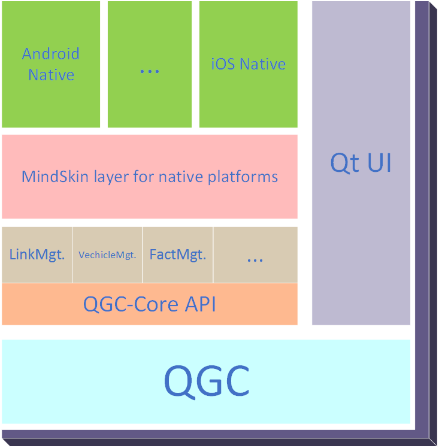
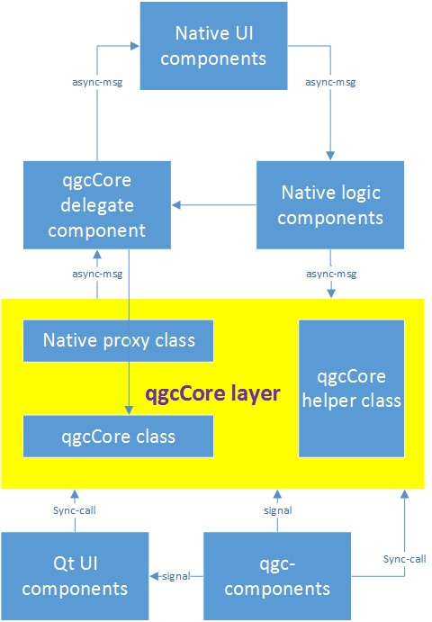

# Concepts

## Central Frame Work

Central is built on top of QGC project, which is a pure Qt based system. The Central framework defines an abstract layer between QGC and other Central application components - qgcCore.  This layer ensures the QGC and Central can talk to each other, while can both evolve independently.

On top of qgcCore is the native-platform dependent implementations, which brings in extensive native user interface in while still following the same framework interface.

An important concept in Central is the application of DroneTag. DroneTag is a technology that allowing an user to access UAV components in a contactless or cable free style, and provide telemetry feedback over-the-air, through radios including but not limited to BLE/Wifi/RFID.

## QGC-core layer

qgcCore layer is an abstraction layer of the core function of QGC system. It separates Central application into 2 spaces: the Qt space, and the native space. Developers add their code into corresponding space depends on the targets and feature they want to achieve. For UI customization or native platform enhancement developers, native space is the most space they work on. For core feature enhancement developers, Qt space will be the most appropriate space to work on.

## Native experience enhancement feature implementation design pattern

## DroneTag API

DroneTag is set of protocols between users/pilots and managed UAV/components that allow users to access/configure drone components over-the-air using near-fielding sensing technology.